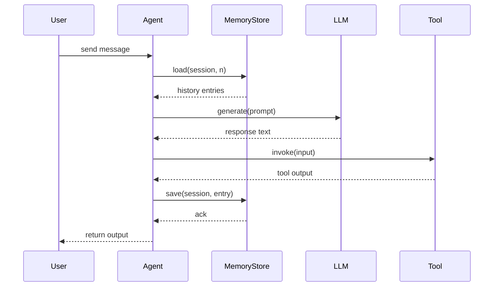

# Integration Patterns for Cogni Agents

This document describes recommended patterns for integrating Agents with Chains, Tools, and Memory in the Cogni framework.

## 1. Introduction
The Cogni framework is structured around four core abstractions:
- **Agent**: Processes inputs, selects tools, and uses memory and LLMs.
- **Chain**: Orchestrates sequences of LLM, tool, and agent steps.
- **Tool**: Provides external functionality via a typed interface.
- **MemoryStore**: Persistently stores and retrieves conversation history.

The purpose of this document is to illustrate how these components compose to form common workflows.

## 2. Core Integration Pattern
The fundamental setup involves:
1. Registering tools in a registry.
2. Creating a memory store instance.
3. Instantiating an agent implementation.
4. Invoking the agent’s `process` method with LLM, tools map, and memory.

```rust
use std::sync::Arc;
use std::collections::HashMap;
use cogni_core::traits::{agent::AgentInput, tool::Tool, memory::MemoryStore};
use my_crate::{MyAgent, SqliteMemoryStore, SearchTool, MathTool};

#[tokio::main]
async fn main() -> anyhow::Result<()> {
    // 1. Register tools
    let mut tools: HashMap<String, Arc<dyn Tool<Input=serde_json::Value,Output=serde_json::Value,Config=()>>> = HashMap::new();
    let search = Arc::new(SearchTool::try_new(())?);
    search.initialize().await?;
    let math = Arc::new(MathTool::try_new(())?);
    math.initialize().await?;
    tools.insert("search".into(), search);
    tools.insert("math".into(), math);

    // 2. Create memory store
    let memory = Arc::new(SqliteMemoryStore::new("chat.db").await?);

    // 3. Instantiate agent
    let agent = MyAgent::try_new(Default::default())?;
    agent.initialize().await?;

    // 4. Process input
    let input = AgentInput { message: "Hello".into(), conversation_id: None, context: serde_json::json!({}) };
    let output = agent.process(input, llm, &tools, memory.clone()).await?;
    println!("Response: {}", output.message);

    Ok(())
}
```

### 2.1 Sequence Diagram


## 3. Composing with Chains
The `Chain` executor can sequence LLM, tool, and agent steps:

```rust
use cogni_core::chain::Chain;
use std::sync::Arc;

#[tokio::main]
async fn main() -> anyhow::Result<()> {
    let chain = Chain::<String, String>::new()
        .add_llm(my_llm, None).await
        .add_tool(my_tool, None).await
        .add_agent(Arc::new(my_agent), None).await;

    let result = chain.execute("Initial input".into()).await?;
    println!("Chain result: {}", result);

    Ok(())
}
```

## 4. Agent-Memory Interaction
Agents receive an `Arc<dyn MemoryStore>` and typically:
- Call `load(session, n)` to retrieve recent history.
- Call `save(session, entry)` to persist new messages.
- Use `query_history` for advanced filtering.

## 5. Agent-Tool Interaction
- Tools are passed as a `HashMap<String, Arc<dyn Tool<...>>>` to `Agent::process`.
- Agents can use a `ToolSelector` to choose tools based on capabilities or patterns.
- Use `ToolSpec` metadata (`name`, `schema`) to build function-calling prompts.

## 6. Error Handling
The framework defines unified errors:
- `AgentError`
- `ToolError`
- `MemoryError`
- `ChainError`
- `LlmError`

Use `Result<T, Error>` and Rust’s `?` operator. Configure timeouts in `ChainConfig` to prevent hanging.

## 7. Extensibility
- Implement `Agent`, `Tool`, `MemoryStore`, or `LanguageModel` traits for custom components.
- Use `ToolSelector` to add dynamic tool-choice strategies.
- Chains support parallel branches via `add_parallel`.

## References
- `core/src/traits/agent.rs`
- `core/src/chain.rs`
- `core/src/traits/tool.rs`
- `core/src/traits/memory.rs`